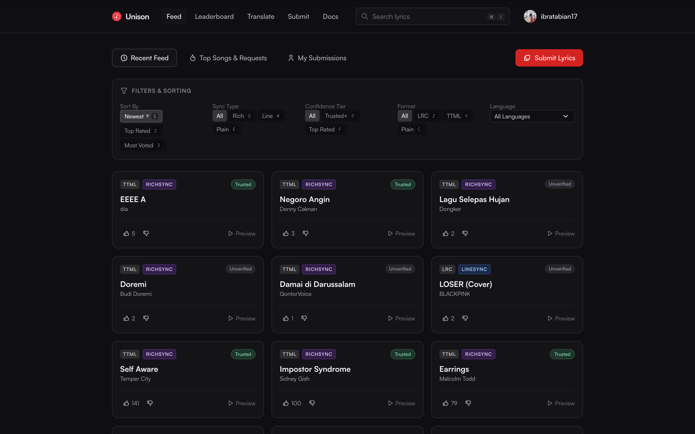

# Yet Another Unison Client



A modern, standalone web client for the [Better Lyrics](https://betterlyrics.org) Unison ecosystem. Explore community lyrics, submit and sync new tracks with Apple Music auto-matching, translate lyrics, and inspect curator leaderboards.

---

## ✨ Features

- **Same as unison.boidu.dev**
  - The web are completely same as the official unison.boidu.dev website. except you can upload and remove your own lyrics & some feature that only available on better-lyrics extension . 

- **Audio Metadata Lookup**
  - Find the song on Apple Music and get the ISRC, Album, and repair artist & title.

---

## 🚀 Getting Started

### Prerequisites

- [Node.js](https://nodejs.org/) (v20 or higher recommended)
- `npm` or `pnpm`

### Installation

1. Clone the repository:
   ```bash
   git clone https://github.com/ibratabian17/unison-client.git
   cd unison-client
   ```

2. Install dependencies:
   ```bash
   npm install
   ```

3. Start the local development server:
   ```bash
   npm run dev
   ```
   Open `http://localhost:5173` in your browser.

---

## 🛠️ Build & Deployment

### Production Build

```bash
npm run build
```
Build output is generated in the `dist/` directory.

### Preview Local Build

```bash
npm run preview
```

### GitHub Pages Deployment

The repository includes a GitHub Actions workflow (`.github/workflows/deploy.yml`) that automatically builds and deploys to GitHub Pages on every push to the `main` branch:

1. Go to repository **Settings** → **Pages**.
2. Under **Build and deployment** → **Source**, select **GitHub Actions**.
3. Push changes to `main` and your site will be live at `https://<username>.github.io/unison-client/`.